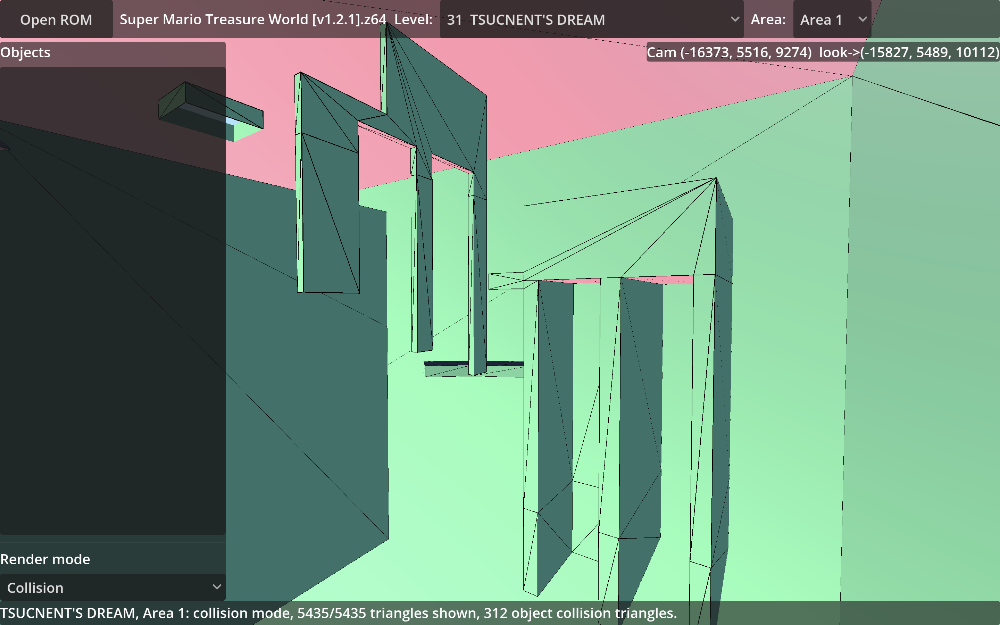

# Tri-64

Extracts geometry, objects, and collision from **Super Mario 64 ROMs** — including
binary ROM hacks — *without* relying on the decompiled source code, and renders the
result in Godot.

The extractor should faithfully reproduce the rendered level: textured triangles,
object placements, collision data, camera info, and level metadata. The renderer
does not need to consume every extracted datum.




## Architecture

    ROM
      ↓
    Level Script VM
      ↓
    Geo Layout Interpreter
      ↓
    Display List Decoder
      ↓
    Scene Representation
      ↓
    Triangle Export
      ↓
    Godot renderer

The stages are loosely coupled:

| Stage | Responsibility |
|---|---|
| Level Script | segment table, memory loading, object spawning, area management, geo entry points |
| Geo Layout | graph node hierarchy, transformations, render layers, object models |
| Fast3D Decoder | matrix stack, vertex cache, texture state, triangle emission |
| Godot Bridge | transform exported data to Godot-native data |
| Godot Renderer | render the level model, render options, camera control |

## Repository layout

```
cpp/        Extractor + Godot extension (C++26, built with SCons)
  src/Memory/   Segment table, MIO0 decompression
  src/Scripts/  Level script VM, geo layout, collision, behavior scripts,
                macro/special preset tables, movtex (water/lava)
  src/Level/    Display list decoder/interpreter, textures, object models,
                level extraction pipeline
  src/ROM.h     ROM loading
  src/godot_bridge.cpp   GDExtension entry point (GodotBridge class)
  tests/        Test suite (scons test)
project/    Godot project (main.gd, main.tscn, GDExtension config)
docs/       Engine.md (implementation-vs-original-engine deviations),
            Quirks.md (pure engine / ROM-hack quirks),
            N64_RDP_State_Machine.md
```

## Building

Prerequisites:

- SCons (`pip install scons`)
- Godot 4.x
- Linux native builds: LLVM/Clang with libc++
- Windows cross-builds: llvm-mingw (`x86_64-w64-mingw32-clang++` and companion
  tools on `PATH`; MinGW GCC is supported as a fallback)
- `godot-cpp` checked out into `cpp/godot-cpp/` (a branch/tag matching your Godot
  version; this directory is gitignored — clone separately or add as a submodule)
- ROM dumps for testing: `baserom.us.z64` (vanilla) and/or a hack such as
  *Super Mario Treasure World*, placed in `cpp/`

Build the native extension and run the tests:

```
cd cpp
scons            # macOS: ../project/bin/libtri64.dylib
                 # Linux: ../project/bin/libtri64.so
scons test       # builds the native test binary
./tests/bin/test # runs the parallel suite (expect 0 FAIL)
```

SCons selects the matching native `godot-cpp` library and builds it when it is
missing. It uses available CPU cores for compilation by default; pass `-jN` or
`jobs=N` to choose a different build concurrency.

Cross-compile the Windows x86_64 extension with llvm-mingw:

```
scons windows    # builds ../project/bin/tri64.windows.x86_64.dll
```

The test executable uses one bounded worker pool. Top-level tests and independent
ROM/level cases run concurrently, including object-model, collision, behavior,
display-list, level-script, and hack-robustness cases. Test output can be
interleaved because cases run concurrently.

## Running

Open `project/` in Godot and run `main.tscn`. Load a ROM, pick a level and area,
then switch between the two render modes:

- **Geometry** — textured/lit level mesh plus object models.
- **Collision** — terrain and object collision triangles, colored by surface type
  (floors blue, walls green, ceilings red), with a widened edge wireframe.

## Compatibility

Supported inputs:

- Vanilla SM64 (US) and most binary ROM hacks
- Custom segment layouts (SM64-editor hacks; see `docs/Quirks.md` for its
  `level script command 0x17` redefinition and the "faked MIO0" segment 2)
- Fast3D microcode (the N64's `fast3d.s`, not F3DEX2); new microcodes can be added
  without modifying the core decoder

## Status

Implemented and verified against the decomp (see `docs/Engine.md` for every
deviation from the original engine):

- MIO0 decompression, segment table (bounds-checked)
- Level script interpreter (warps, painting/instant warps, whirlpools, music,
  dialog, transitions, Mario spawn, area→camera wiring)
- Geo layout processor (camera node, generated nodes, background, culling radius,
  view registry, switch-case/perspective/held-object funcs)
- Fast3D display list decoder (matrix stack, vertex cache, per-vertex lighting,
  combine-based texture classification, clamp/repeat, CI4/CI8/IA/I/RGBA32 textures,
  TLUTs, lights/fog)
- Collision decoder (surface flags, floor/wall/ceiling classification,
  lowerY/upperY, water boxes, rooms, object `LOAD_COLLISION_DATA`)
- Behavior script static analysis (field-write capture, frame-0 object animation)
- Object models (preset tables from the main segment, model mesh bake, frame-0
  animation)
- Movtex water/lava quad extraction
- Godot renderer with Geometry and Collision modes

## Documentation

- `docs/Engine.md` — how our implementation deviates from the original SM64
  engine, organized by subsystem.
- `docs/Quirks.md` — pure engine and ROM-hack quirks.
- `docs/N64_RDP_State_Machine.md` — N64 RDP reference.

## Authorship

Most of the code in this repository was written by the AI model
**deepseek-v4-flash**.
